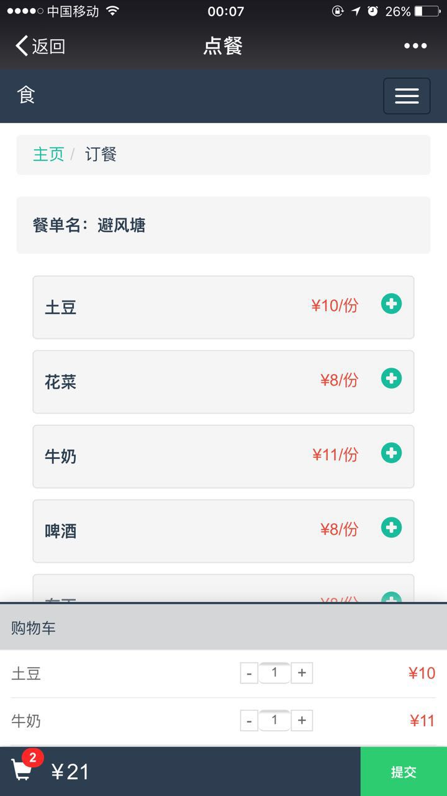
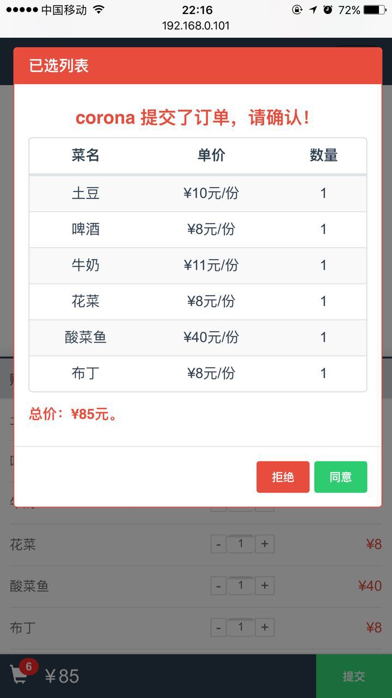

## 食

《食》是一个多人实时点餐的系统，适应的场景是：多人在线点餐，最后汇总成一个订单，并提交给商家。（暂时还没有做商家功能，后续添加）
举个"栗子"：
团队内有10个人，想多人对一家饭店的菜单进行点餐，每个人的点餐动作会实时同步到当前团队内的其他成员的页面上，最后提交一个汇总的订单。

该系统拥有自适应页面，已适配绝大多数PC端和移动端浏览器。

## 系统截图

### PC端

### Mobile端

更多系统截图，见[此处](./screenshots/README.md)。

## 技术选型

1. 服务器端使用 express 和 nodejs
2. 数据库采用 mongodb
3. 前段框架使用 angularJS及jquery
4. 页面UI采用bootstrap系主题

## 项目准备

1. 安装mongodb数据库

具体安装方式，请根据自身电脑类型，自行完成。

安装完成后，进行数据库配置（以下在mongd启动之后，命令行中执行）：

        > $ mongd
        > $ use food
        > $ db.createUser({
              user: "admin",
              pwd: "123456",
              roles: [{
                role: "userAdmin",
                db: "food"
              }, {
                role: "readWrite",
                db: "food"
              }]
            });

2. fork并下载代码到本地 

代码下载到本地后，在项目目录下执行命令来安装项目依赖的插件。

（这一步，是在你已经安装了nodejs及npm的前提下，如果没有安装，请自行安装）

        > $ npm install

3. 在配置好数据库，并安装好项目以来插件后，就是启动系统并访问了

完成前两步后，直接在项目根目录下执行以下命令来启动系统：

        > $ node app

然后，就在浏览器中访问系统：

        localhost:3000

4. 到达这一步，说明你已经成功访问系统了。
